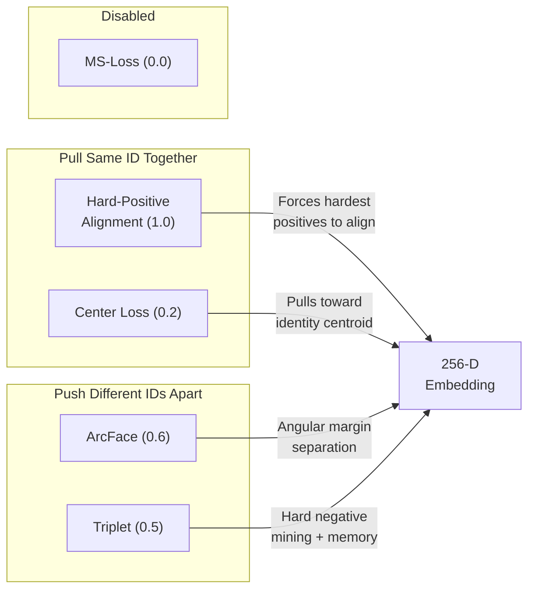
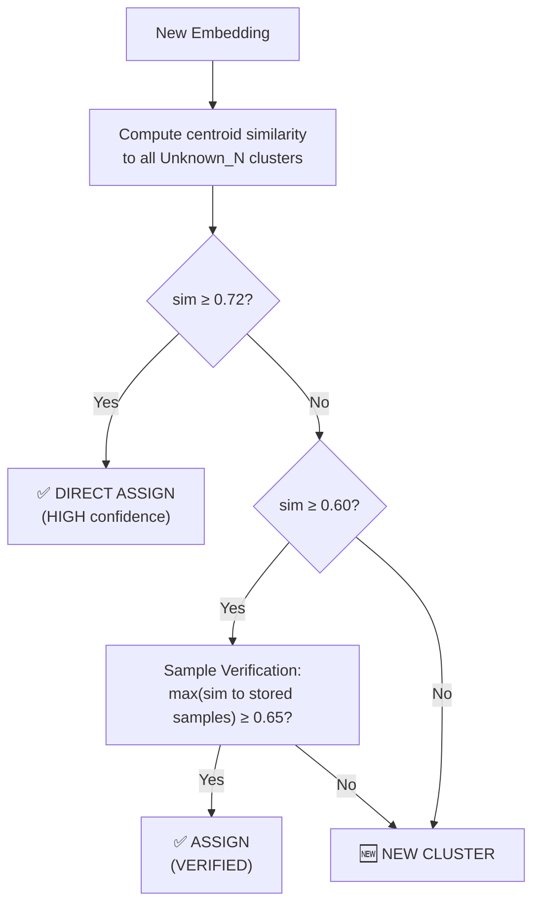

# 🐘 Elephant Re-Identification System — Complete Project Guide

> **Project:** Wildlife Institute of India (WII) — Unique Elephant Identification  
> **Current Model:** V8.2 · ConvNeXt-Tiny · 128-D embeddings  
> **Stack:** Python · PyTorch · YOLOv8 · PyQt6

---

## Table of Contents

1. [System Overview](#1-system-overview)
2. [Training Notebook — V8 (Loss Functions & Training)](#2-training-notebook)
3. [Pipeline — Detection & Embedding (`pipeline.py`)](#3-pipeline)
4. [Core Engine — Matching & Clustering (`core_engine.py`)](#4-core-engine)
5. [Desktop Application (`app.py`)](#5-desktop-application)
6. [Supporting Modules](#6-supporting-modules)
7. [End-to-End Data Flow](#7-end-to-end-data-flow)
8. [Model Evolution History](#8-model-evolution)
9. [Key Design Rationale](#9-design-rationale)

---

## 1. System Overview

### Project Structure
The repository is heavily optimized around a **primary triad** of Python files that execute the production logic:
- `app.py` — The PyQt6 desktop GUI interface for the Human-in-the-Loop workflow.
- `pipeline.py` — The deep learning stack (YOLO detection, geometrical cropping, and 128-D generic ConvNeXt inference).
- `core_engine.py` — The statistical matrix engine that performs clustering and match assignments.

All auxiliary evaluations and data-scrubbing tools live safely within the `tools/` directory.

### Flow Architecture
The system performs **open-set biometric re-identification** of wild Asian elephants. Given a batch of field photographs, it:

1. **Detects** the elephant's head (YOLOv8n head detector)
2. **Crops & Validates** the head region (quality gate + reference bank)
3. **Extracts** a compact embedding vector (ConvNeXt-Tiny → 128/256-D)
4. **Matches** against a gallery of known elephants — or clusters unknowns together
5. **Routes** ambiguous cases to a human reviewer via a desktop application

```text
[ 📷 Raw Field Image ]
         │
         ▼
[ YOLOv8n Head Detection ]
         │
         ▼
[ Crop & Quality Gate ]
         │
         ▼
[ ConvNeXt Embedding (128-D) ]
         │
         ▼
[ Gallery Matching & Graph Clustering ] ──(Ambiguous)──> [ ⚠ Human Review Queue ]
         │                                                      │
         ▼                                                      │
[ ✅ Named Identities & Unknown Clusters ] <──────────────────────┘
```
*(See Section 7 for the complete End-to-End Data Flow diagram)*

> **IMPORTANT:**
> The system is designed to be **conservative** — it would rather ask a human than make a wrong match. In wildlife conservation, a false merge (thinking two different elephants are the same) corrupts population records and is far worse than a missed match.

---

## 2. Training Notebook

**File:** [create_head_embedding_nb_v8.py](file:///d:/Elephant_ReIdentification/kaggle/create_head_embedding_nb_v8.py)  
**Generated notebook:** `elephant-head-embedding-training-v8.ipynb` (runs on Kaggle GPU)

### 2.1 Problem Statement

The V8 model addresses **identity fragmentation** — the tendency for different photos of the *same* elephant to be embedded far apart, causing the system to think they are different individuals. Previous versions achieved good inter-class separation (different elephants are far apart) but poor intra-class compactness (same elephant photos are not close enough).

### 2.2 Model Architecture

```python
class HeadEmbeddingModel(nn.Module):
    backbone = ConvNeXt-Tiny(ImageNet pretrained)  # 768-D feature extractor
    pool     = AdaptiveAvgPool2d(1)                # Global spatial pooling
    embed    = Sequential(
        Linear(768 → 512) → BatchNorm1d → ReLU → Dropout(0.3)
        Linear(512 → 256) → BatchNorm1d
    )
    # Output: L2-normalized embedding vector
```

| Property | Value |
|----------|-------|
| **Backbone** | ConvNeXt-Tiny (28.6M params) |
| **Input size** | 224 × 224 RGB |
| **Embedding dim** | 256 (saved as 128 after v8.2 compression) |
| **Output normalization** | L2-norm (unit hypersphere) |
| **Total params** | ~29M |

### 2.3 Dataset

| Property | Value |
|----------|-------|
| **Dataset** | `training_heads_v6` (curated WII head crops) |
| **Min images per identity** | 3 |
| **Pruned identities** | 35 bad classes (label noise, disconnected views) |
| **Train/Eval split** | 80/20 **identity-disjoint** (zero-shot eval) |

> **NOTE:**
> **Identity-disjoint split** means the eval set contains elephants the model has **never seen during training**. This gives honest metrics — if we included training elephants in eval, the scores would be artificially inflated.

**Bad classes removed** (examples):
- `Makhna_1`, `Makhna_2`, `Makhna_3`, `Makhna_4` — inconsistent labels
- `Herd_4_AF_ELE_1`, `Herd_4_AF_ELE_31` — cross-identity collisions from YOLO crops
- Identities where `min_sim < 0.20` or `mean_sim < 0.55` — disconnected views

### 2.4 Loss Functions (5 Combined Losses)

The total training loss is:

```
Total = 0.0×MS + 1.0×HardPos + 0.2×Center + 0.6×ArcFace + 0.5×Triplet
```

---

#### 2.4.1 ArcFace Loss (Weight: 0.6)

**Purpose:** Classification-based loss that pushes each identity to a unique direction on the embedding hypersphere.

**How it works:**
- Maintains a learnable weight matrix `W` of shape `(num_classes, embed_dim)` — one prototype vector per identity
- For each sample, computes cosine similarity to all class prototypes
- Adds an angular margin `m` to the true class angle, making correct classification harder
- This forces the model to learn more discriminative features

**Math:**
```
cosθ = W_normalized · embedding       (cosine similarity to all classes)
ψ(θ) = cos(θ + m)                     (add margin to true class angle)
Loss = CrossEntropy(scale × [one_hot × ψ + (1 - one_hot) × cosθ], labels)
```

**Hyperparameters:**
| Param | Value | Meaning |
|-------|-------|---------|
| `margin` | 0.35 | Angular margin in radians (~20°) |
| `scale` | 32.0 | Temperature scaling |
| `weight` | 0.6 | Contribution to total loss |

**Why it matters:** Without ArcFace, the model might cluster embeddings loosely. ArcFace forces each identity to occupy a tight angular region on the hypersphere, creating clear decision boundaries.

**Why weight reduced from earlier versions (0.25→0.6 in v8, was higher in v4-v6):** ArcFace alone pushes classes apart but doesn't force same-class samples together. Too much ArcFace = good separation but fragmented same-identity embeddings. The balance with Hard-Positive loss is crucial.

---

#### 2.4.2 Multi-Similarity Loss V3 (Weight: 0.0 — disabled in V8)

**Purpose:** Fine-grained pair mining that weights hard positive/negative pairs more heavily.

**How it works:**
- For each anchor, finds positive pairs (same identity) and negative pairs (different identity)
- Uses exponential weighting: pairs that are "just barely" correct or incorrect get the highest gradients
- `alpha` controls positive pair sensitivity, `beta` controls negative pair sensitivity

**Math:**
```
For each anchor i:
  pos_loss = (1/α) × log(1 + Σ exp(-α × (S_pos - λ)))    # push positives above λ
  neg_loss = (1/β) × log(1 + Σ exp( β × (S_neg - λ)))     # push negatives below λ
  
  where S = similarity/temperature,  λ = base/temperature = 0.5/0.2 = 2.5
```

**Hyperparameters:**
| Param | Value | Meaning |
|-------|-------|---------|
| `alpha` | 2.0 | Positive pair gradient sensitivity |
| `beta` | 75.0 | Negative pair gradient sensitivity |
| `base` | 0.5 | Decision boundary |
| `hard_neg_k` | 20 | Only use top-20 hardest negatives |
| `temperature` | 0.2 | Sharpens similarity distribution |
| `weight` | **0.0** | **Disabled** — HardPos replaced its role |

> **NOTE:**
> MS-Loss was the primary driver in v3-v7 but is disabled in v8. Hard-Positive Alignment replaced its intra-class role more effectively.

---

#### 2.4.3 Hard-Positive Alignment Loss (Weight: 1.0) — ⭐ Key V8 Innovation

**Purpose:** Forces the model to embed **all views of the same elephant** close together, even the hardest ones (extreme pose change, different ear visibility).

**The problem it solves:** Without this loss, the model learns "average elephant head shape" but not "this specific ear notch is the identity cue." When a photo shows a completely different angle, the model fails.

**How it works:**
1. For each anchor image, find the **k hardest positives** (same identity, lowest similarity)
2. Penalize if the hardest positive is further than a `margin`
3. This forces the model to bring even the most dissimilar same-identity views together

**Math:**
```
For each anchor i:
  hard_positives = top-k lowest similarity same-identity samples
  loss = mean(ReLU(margin - sim(anchor, hard_pos)))
  
  # If hardest positive similarity = 0.45 and margin = 0.7:
  #   loss = ReLU(0.7 - 0.45) = 0.25 → strong gradient signal
  # If hardest positive similarity = 0.85:
  #   loss = ReLU(0.7 - 0.85) = 0.0 → already good, no gradient
```

**Hyperparameters:**
| Param | Value | Meaning |
|-------|-------|---------|
| `k` | 2 | Find 2 hardest positives per anchor |
| `margin` | 0.7 | Target minimum similarity for hard positives |
| `weight` | **1.0** | **Highest priority loss** |

**Why this is the most important loss:** For elephant `Makhna_6`, the hardest positive might be a photo where the distinctive ear tear is visible from a completely different angle. By forcing the model to align anchor ↔ hardest-positive, we teach it: *"this specific ear notch pattern is the identity cue, not the head shape or lighting."*

**Also tracks:** `mean_hard_sim` — the average similarity of the hardest positive pairs across the batch. This metric should increase over training (model gets better at aligning hard positives).

---

#### 2.4.4 Global BatchHard Triplet Loss (Weight: 0.5)

**Purpose:** Hard negative mining with a memory bank, ensuring different elephants are pushed apart.

**How it works:**
1. **Standard triplet:** For each anchor, find the hardest positive (lowest sim, same ID) and hardest negative (highest sim, different ID)
2. **Memory bank:** Maintains a rolling buffer of 2048 past embeddings + labels. During each batch, negatives are mined from both the current batch AND the memory bank
3. Loss = `ReLU(hardest_negative - hardest_positive + margin)`

**Math:**
```
For each anchor i:
  hardest_pos = min similarity among same-identity samples
  hardest_neg = max(
      max similarity in current batch (different ID),
      max similarity in memory bank (different ID)
  )
  loss = ReLU(hardest_neg - hardest_pos + margin)
```

**Hyperparameters:**
| Param | Value | Meaning |
|-------|-------|---------|
| `margin` | 0.50 | Required gap between positive and negative |
| `memory_size` | 2048 | Rolling buffer of past embeddings |
| `embed_dim` | 256 | Embedding dimension |
| `weight` | 0.5 | Contribution to total loss |

**Why memory bank matters:** With only 24 images per batch (8 identities × 3), the number of hard negatives is limited. The memory bank provides 2048 additional comparison points from previous batches, making hard negative mining much more effective.

---

#### 2.4.5 Identity Center Loss (Weight: 0.2)

**Purpose:** Regularizer that pulls all samples of the same identity toward their mean (centroid).

**How it works:**
1. For each identity in the batch, compute the mean embedding (centroid)
2. Penalize the squared distance from each sample to its identity centroid

**Math:**
```
For each identity class c:
  center_c = mean(embeddings where label == c)
  loss_c = mean(||embedding_i - center_c||²)  for all i in class c
  
Total = average over all classes
```

**Hyperparameters:**
| Param | Value | Meaning |
|-------|-------|---------|
| `weight` | 0.2 | Low weight — gentle regularizer |

**Why gentle:** Center loss can conflict with Hard-Positive Alignment if too strong. Hard-Pos works on the *worst* pairs; Center loss works on the *average*. Too much center loss smooths out the gradient signal from hard positives.

---

### 2.5 Summary of Loss Roles



### 2.6 Diversity Sampling Strategy (P×M Sampler)

Instead of random batching, each training batch is carefully constructed:

- **P = 8** identities per batch
- **M = 3** samples per identity
- **Total batch = 24 images**

**Sample selection:** 70% diversity sampling (pick the most different views of each identity) + 30% random (prevent overfitting to extremes).

**Diversity sampling algorithm:**
1. Start with a random image for each identity
2. For next sample, pick the one that is **most different** from all already-selected samples
3. This ensures each batch contains the most challenging within-identity variations

### 2.7 Training Phases

```
Phase 1 (Epochs 1–5): BACKBONE FROZEN
  ├── Only embed head (Linear layers) trains
  ├── LR: embed = 1e-4, ArcFace = 1e-4
  └── Purpose: Initialize embedding head without corrupting backbone

Phase 2 (Epochs 6–30): FULL FINE-TUNE
  ├── Backbone unfrozen with differential LR
  ├── Backbone LR: 5e-6 (20× lower)
  ├── Embed LR: 5e-5
  ├── Scheduler: Cosine annealing
  └── Purpose: Fine-tune backbone features for elephant identity cues
```

### 2.8 Evaluation (Zero-Shot)

The eval set uses a **Flip TTA** (Test-Time Augmentation):
```python
emb = normalize((model(image) + model(flip(image))) / 2)
```
This averages the original and horizontally-flipped embeddings, reducing noise from asymmetric features.

**Metrics computed:**
| Metric | What it measures |
|--------|------------------|
| Same-ID mean/min sim | How tight are within-identity embeddings? |
| Diff-ID mean/max sim | How separated are different identities? |
| Separation gap | same_mean - diff_mean (higher = better) |
| False merge @ 0.65, 0.75 | % of different-ID pairs above threshold |
| Fragmentation @ 0.65 | % of same-ID pairs below threshold |
| Centroid Rank-1 | % of images whose nearest centroid is correct |
| Ambiguity analysis | How many images have ambiguous top-2 choices |

**Full dataset audit** also runs:
- Per-identity intra-similarity table (flags identities with min_sim < 0.30)
- Top-25 worst cross-identity false matches
- Split identity detection (different label, but consistently high similarity → might be same elephant mislabeled)

### 2.9 Augmentations (Conservative V8)

```python
train_transform = [
    Resize(256, 256),
    RandomResizedCrop(224, scale=(0.8, 1.0)),    # conservative crop jitter
    RandomHorizontalFlip(p=0.5),
    ColorJitter(brightness=0.3, contrast=0.3, saturation=0.3, hue=0.1),
    ToTensor(), Normalize(ImageNet),
    RandomErasing(p=0.2, scale=(0.02, 0.06)),    # tiny patches only
]
```

> **IMPORTANT:**
> V8 uses **minimal augmentation** intentionally. Heavy augmentation (perspective warp, large erasing) would destroy the very identity cues (ear tears, wrinkle patterns) the Hard-Positive loss is trying to teach the model to use.

---

## 3. Pipeline

**File:** [pipeline.py](file:///d:/Elephant_ReIdentification/pipeline.py) (1,354 lines)

### 3.1 Head Detection — Multi-Scale YOLO Cascade

Full wildlife images pose a challenge: an elephant's head may occupy only **5-15%** of the frame in distant shots.

```
Scale 1: imgsz=640   → fast, catches close-ups
Scale 2: imgsz=1024  → medium range  
Scale 3: imgsz=1280  → catches distant heads
Fallback: Tiled detection (2×2 and 3×3 sub-images)
```

**Each detection goes through geometric validation:**

| Check | Threshold | Purpose |
|-------|-----------|---------|
| Area ratio | 0.1% – 90% of frame | Reject tiny noise and full-frame false positives |
| Aspect ratio | 0.35 – 2.80 | Reject extreme shapes |
| Confidence | ≥ 0.20 | YOLO confidence floor |

**Arrow detection:** WII field photos sometimes have red arrows pointing at target elephants. The pipeline detects these arrows using HSV color filtering and uses them to prioritize which head to crop when multiple are detected.

### 3.2 Crop & Quality Gate

After detecting the head bounding box, the pipeline:

1. **Square-crops** the head region (geometric consistency)
2. **Tries multiple padding ratios** (tight, medium, loose) — scores each against the head reference bank
3. **Quality checks:**

| Check | Threshold | Purpose |
|-------|-----------|---------|
| Blur (Laplacian variance) | > 50 | Reject motion blur |
| Contrast (pixel std dev) | > 30 | Reject washed-out images |
| Center saturation | < 95 | Reject solid-color artifacts |
| Min edge size | ≥ 80px | Reject tiny crops |
| Head reference bank sim | Adaptive | Verify crop is actually a head |

### 3.3 Head Reference Bank

A pre-computed manifold of ~512 valid head embeddings stored in `head_crop_reference_bank_v2.pt`.

**How it works:**
- When a crop is embedded, compute its top-k similarity to the reference bank
- If it doesn't look like any known head (low similarity), it's probably a YOLO false positive (rocks, bushes, ears of other species)
- Also includes **negative references** (`_no_head_in_crop`) for contrast

**Thresholds:**
| Param | Value | Meaning |
|-------|-------|---------|
| `MIN_MAX_SIM` | 0.20 | Minimum max similarity to any reference head |
| `MIN_TOPK_SIM` | 0.14 | Minimum mean of top-5 similarities |
| `CAP_MAX_SIM` | 0.66 | Above this, definitely a head (skip further checks) |
| `MIN_MARGIN` | 0.05 | Must score higher for positive refs than negative refs |

### 3.4 Model Loading (Dynamic Resolver)

```python
def _resolve_reid_model():
    # Priority order:
    # 1. Environment variable override: ELEPHANT_REID_MODEL
    # 2. v8.2 → v8.1 → v8 → v7 → v3 → v2 → v1 (first found wins)
    for name in ("v8.2.pth", "v8.1.pth", "v8.pth", ...):
        if (MODELS_DIR / name).exists():
            return p
```

**Checkpoint validation:** On load, the pipeline reads `embed.4.weight.shape[0]` from the state dict to auto-detect embedding dimension. This prevents dimension mismatches when switching between model versions.

---

## 4. Core Engine

**File:** [core_engine.py](file:///d:/Elephant_ReIdentification/core_engine.py) (2,460 lines)

### 4.1 Gallery Matching (`_predict_from_emb`)

When an embedding arrives, it's compared against every identity in the gallery:

```
1. Compute cosine similarity: query · gallery_embeddings.T
2. For each identity: take top-3 mean similarity
3. Apply consistency gate (prevents single-sample flukes)
4. Check if best score > threshold and gap to 2nd > margin
```

**Matching confidence levels:**

| Level | Conditions | Action |
|-------|-----------|--------|
| **HIGH** | score > mean+0.20, gap > 0.08 | ✅ Confident match |
| **MEDIUM** | score > mean+0.20, gap > 0.04 | ✅ Match with lower confidence |
| **Unknown** | Below thresholds | → enters clustering pipeline |

**Consistency gate:** If the top match has high top-1 similarity but very low top-2 similarity with the same identity (e.g., `top3[0]=0.85, top3[1]=0.30`), the score is penalized by 0.7x. This prevents fluky single-sample matches.

**Same-herd check:** If the top-2 matches are from the same herd and the gap < 0.10, the system forces "Unknown." Elephants in the same herd share environmental/genetic appearance traits.

### 4.2 K-Reciprocal Re-Ranking

Advanced distance refinement algorithm (from Zhong et al., CVPR 2017):

```
1. Compute cosine distance matrix
2. For each image, find its k-reciprocal nearest neighbors
   (neighbors that also rank this image in THEIR top-k)
3. Build Jaccard distance from reciprocal neighbor sets
4. Final distance = (1-λ) × Jaccard + λ × original cosine
```

**Why:** Rewards pairs that are **mutually** nearest neighbors (true identity matches) and penalizes coincidental high similarity from shared backgrounds.

### 4.3 Unknown Cluster Manager

**Class:** `UnknownClusterManager` — manages cross-session identity clusters for elephants not in the gallery.

**Cluster data structure (JSON-persisted):**
```json
{
  "Unknown_1": {
    "centroid": [0.123, -0.456, ...],     // 128-D, L2-normalized mean
    "samples": [[...], [...], ...],       // Up to 10 representative embeddings
    "count": 15,                          // Total images assigned  
    "variance": 0.08,                     // Intra-cluster variance
    "created_at": "2026-04-12T...",
    "stability_flag": false,
    "growth_warning": false
  }
}
```

**Dual-threshold assignment logic:**



**Ambiguity detection:**
- If top-2 candidates are within `gap < 0.10` → flag as **AMBIGUOUS**
- Stored in `ambiguities.json` for human review

**Sample cap with diversity replacement:**
- Each cluster keeps max 10 representative embeddings
- When cap is reached, the **most redundant** sample (closest to centroid) is dropped
- This preserves edge-case poses that are critical for robust matching

### 4.4 Graph-Based Connected-Component Clustering (Phase 2)

For within-batch clustering of unknown images:

```
STEP 1: Stack all unknown embeddings → L2-normalize
STEP 2: Compute full NxN pairwise cosine similarity matrix
STEP 3: Union-Find on STRONG pairs (sim > 0.72) → anchor groups
STEP 4: Expand anchors with looser edges (sim > 0.47)
STEP 5: Deduplicate — ensure each node in exactly one cluster
STEP 6: Ambiguity refinement:
  - If cluster has std > 0.12 or (mean < 0.60 and min < 0.45) → AMBIGUOUS
  - Refine: keep core nodes (avg_sim > 0.50), isolate the rest
STEP 7: Gallery conflict check — if cluster centroid sim > 0.75 to gallery → flag
```

**Key thresholds:**
| Param | Value | Purpose |
|-------|-------|---------|
| `STRONG_MATCH_THRESHOLD` | 0.72 | Union-Find anchor threshold |
| `GRAPH_EDGE_THRESHOLD` | 0.47 | Expansion threshold |
| `GRAPH_CLUSTER_MEAN_MIN` | 0.48 | Minimum mean intra-cluster sim |
| `GRAPH_CLUSTER_MIN_SIM` | 0.40 | Minimum pairwise sim in cluster |

**Why graph-based instead of centroid-based?**
- Centroids can **drift** with bad images → permanent corruption
- Graph clustering is **transitive**: A↔B and B↔C ⟹ A,B,C cluster together
- Prevents **chain-link false merges**: two clusters connected only by a weak single edge stay separate

### 4.5 Post-Batch Processing

After all images are assigned:

1. **Cluster merging:** Check all cluster pairs — if centroid sim > 0.72 AND ≥2 sample pairs match AND mean cross-sim ≥ 0.69 → merge
2. **Singleton post-pass:** Re-check isolated images against all clusters. Auto-merge if confidence ≥ 0.72; queue for review if 0.50–0.72
3. **Health checks:**
   - Growth guard: flag if >5 additions caused centroid shift > 0.04
   - Stability score: flag if std/mean > 0.18 or min pairwise sim < 0.25
4. **Structural merge suggestions:** Cross-cluster similarity analysis for human review

### 4.6 Merge Guards (Triple Condition)

Before any two clusters can merge, ALL three must pass:

```
1. centroid_sim(A, B) ≥ merge_threshold (0.72)
2. ≥ 2 sample pairs where cross_sim ≥ merge_threshold
3. mean cross-sample similarity ≥ merge_threshold - 0.03
```

This prevents merges driven by a single lucky pair while the overall distributions don't actually match.

---

## 5. Desktop Application

**File:** [app.py](file:///d:/Elephant_ReIdentification/app.py) (3,869 lines)  
**Framework:** PyQt6

### 5.1 Four-Tab Interface

| # | Tab Name | Purpose |
|---|----------|---------|
| 1 | **Mass Upload** | Select input folder → run batch classification → view results |
| 2 | **Review & Correct** | Browse gallery tree → view images per identity → reassign errors |
| 3 | **Train Database** | Register new elephants from verified images → update gallery |
| 4 | **Review & Merge** | Resolve ambiguous matches, merge/split clusters, promote to identity |

### 5.2 Tab 1 — Mass Upload (Batch Classification)

- **Input:** Select folder of images
- **Output:** Select output directory
- **Processing:** Runs `ElephantEngine.process_batch()` in a `WorkerThread` (background thread keeps UI responsive)
- **Progress bar:** Updates from 0–100% across processing phases
- **Results:** Classification report showing known matches and unknown clusters

### 5.3 Tab 2 — Review & Correct (Gallery Browser)

- **Tree view:** All identity folders in the output directory
- **Gallery view:** Thumbnails of images in selected folder
- **Right-click menu:** "Reassign to Specific Elephant..." → searchable combo box of all gallery identities
- **Cluster review panel:** Shows stats for Unknown_N clusters (size, variance, stability, recommendations)
- **Promote button:** Convert an Unknown_N cluster into a named identity in the gallery

### 5.4 Tab 4 — Review & Merge (Ambiguity Inbox)

The inbox has **three priority sections:**

```
⚠ Ambiguous Matches ⚠     ← TOP PRIORITY (red background)
  Images that matched two clusters equally well
  
Merge Suggestions           ← System-suggested merges
  Clusters that look like they might be the same elephant
  
Clusters                    ← All Unknown clusters for review
```

**For each cluster, the system shows:**
- Image grid (3 columns) with outliers highlighted
- **Merge suggestion panel** with scored candidates:
  - Direct centroid similarity
  - Bridge path similarity (transitive connection via shared neighbor)
  - Cohesion analysis (how well it fits internally)
  - Confidence level: HIGH / MEDIUM / LOW / WEAK
- **Compare dialog:** Side-by-side image comparison with similarity metrics

**Actions available:**
| Action | What it does |
|--------|-------------|
| Remove Selected | Move bad images to review buffer (with undo) |
| Keep Cluster | Accept as separate identity |
| Split Cluster | Break apart a mixed cluster |
| Promote to Identity | Name and add to gallery |
| Merge → | Merge with suggested cluster |
| Compare 🔍 | Open side-by-side comparison dialog |

### 5.5 Session Persistence

| File | Format | Contents |
|------|--------|----------|
| `app_config.json` | JSON | Last-used output directory |
| `unknown_clusters.json` | JSON | All cluster centroids, samples, metadata |
| `ambiguities.json` | JSON | Ambiguity queue (open + resolved) |
| `feedback_pairs.json` | JSON | Positive/negative pairs from human decisions |
| `merge_decisions.csv` | CSV | Log of all merge accept/reject decisions |
| `elephant_reid_runtime.log` | Text | Full processing log |

---

## 6. Supporting Modules

### 6.1 ReviewStore (`review_store.py`, 192 lines)

JSON-backed persistence for the ambiguity review queue.

**Key methods:**
| Method | Purpose |
|--------|---------|
| `add_ambiguity(record)` | Queue an ambiguous match with deduplication |
| `add_ambiguous_match(node_path, candidates)` | Queue a direct ambiguous match (tied between 2 clusters) |
| `list_ambiguities(unresolved_only)` | Retrieve open review items |
| `resolve_ambiguity(id, resolution)` | Mark as resolved with decision data |
| `resolve_open_ambiguities(filenames, cluster_names)` | Bulk-resolve related items |
| `add_feedback_pair(pair)` | Store positive/negative feedback for future training |

### 6.2 ClusterHealthMonitor (`cluster_health.py`, 230 lines)

Four safety checks:

| Check | Threshold | Trigger |
|-------|-----------|---------|
| **Growth guard** | ≥5 additions + centroid shift ≥0.04 | Possible contamination |
| **Stability score** | std/mean > 0.18 OR min_sim < 0.25 | Cluster is internally inconsistent |
| **Merge guard** | Triple condition (centroid + 2 samples + mean) | Before any auto-merge |
| **Duplicate detection** | Gallery centroid sim ≥ 0.40 | Two gallery identities might be same elephant |

---

## 7. End-to-End Data Flow

```
               ┌─────────────────────────────────────────────┐
               │              INPUT: Image Batch             │
               └──────────────────┬──────────────────────────┘
                                  │
                    ┌─────────────▼──────────────┐
                    │  YOLO HEAD DETECTION        │
                    │  Multi-scale: 640→1024→1280 │
                    │  + Tiled recovery           │
                    └─────────────┬──────────────┘
                                  │
                    ┌─────────────▼──────────────┐
                    │  CROP QUALITY GATE          │
                    │  Blur, contrast, saturation │
                    │  Head reference bank check  │
                    └──────┬──────────────┬──────┘
                     Pass  │              │ Fail
                           │              ▼
                    ┌──────▼──────┐  ┌──────────┐
                    │  EMBEDDING  │  │ Rejected/ │
                    │  ConvNeXt   │  │ WeakCrop  │
                    │  → 128-D    │  └──────────┘
                    └──────┬──────┘
                           │
              ┌────────────▼────────────┐
              │  GALLERY MATCHING       │
              │  top-k centroid scoring │
              │  consistency gate       │
              └───┬────────────────┬───┘
            Known │                │ Unknown
                  ▼                ▼
         ┌──────────────┐  ┌──────────────────────┐
         │ Named Folder │  │ GRAPH CLUSTERING      │
         │ + Watermark  │  │ Union-Find anchors    │
         └──────────────┘  │ Edge expansion        │
                           │ Ambiguity refinement  │
                           └───┬──────────────┬───┘
                         Clean │              │ Ambiguous
                               ▼              ▼
                      ┌──────────────┐ ┌─────────────────┐
                      │ Unknown_N    │ │ Ambiguity Queue  │
                      │ folder       │ │ (human review)   │
                      └──────┬───────┘ └────────┬────────┘
                             │                  │
                      ┌──────▼──────────────────▼──────┐
                      │  POST-PASS                      │
                      │  • Singleton re-check           │
                      │  • Auto-merge (≥0.72)           │
                      │  • Health checks                │
                      │  • Structural merge suggestions │
                      └────────────────────────────────┘
```

---

## 8. Model Evolution

| Ver | Key Change | Result |
|-----|------------|--------|
| v1 | ConvNeXt + basic triplet | Baseline, heavy fragmentation |
| v2 | Added MS-Loss | Better hard-negative mining |
| v3 | Augmentation improvements | More robust to lighting |
| v4 | Cleaned training data, pruned bad identities | Reduced label noise |
| v5 | Identity-disjoint eval split | Honest zero-shot metrics |
| v6 | Clean dataset v6 | Further data quality |
| v7 | Square crop normalization + TTA | Embedding stability across poses |
| v7.5 | Multi-scale crop + perspective aug | Incremental improvements |
| **v8** | **Hard-Positive Alignment + graph clustering** | **Solved identity fragmentation** |
| v8.1 | Flip TTA in eval, centroid matching | Better eval protocol |
| **v8.2** | **Threshold tuning, ambiguity refinement** | **Production-ready** |

---

## 9. Design Rationale

### Why Head-Only?
- Elephants are frequently **partially occluded** by vegetation
- Heads contain the most **discriminative features**: ear tears, tusk patterns, wrinkle maps
- Full-body embeddings are dominated by background and lighting (not identity cues)

### Why Human-in-the-Loop?
- A **false merge** (confusing two different elephants) **corrupts population records** — far worse than missing a match
- `AUTO_ENROLL_PROVISIONAL = False` — new identities must be **explicitly confirmed** by a human  
- The system uses the model as a **guide** for human validation, not as a final decision-maker

### Why Graph Clustering?
- K-Means requires knowing K (impossible for open-set)
- Centroid-based methods suffer from **drift** — one bad crop permanently poisons
- Graph clustering is **self-correcting** via the consistency gate

### Why 5 Losses?
- Each loss targets a different aspect of the embedding space:
  - ArcFace → angular separation between classes
  - Hard-Positive → collapse within-class variance
  - Triplet → hard negative mining with memory
  - Center → gentle centroid regularization
  - MS-Loss → (disabled but available for future versions)
- No single loss achieves the required balance of tight clusters and clear separation

### Why Conservative Thresholds?
- The WII elephant similarity distribution is very compressed:
  - Within-elephant max similarity range: **0.29–0.42**
  - Cross-elephant max similarity: up to **0.33**
- This overlap zone means every threshold must be carefully calibrated
- Better to send an image to human review than to auto-assign incorrectly
