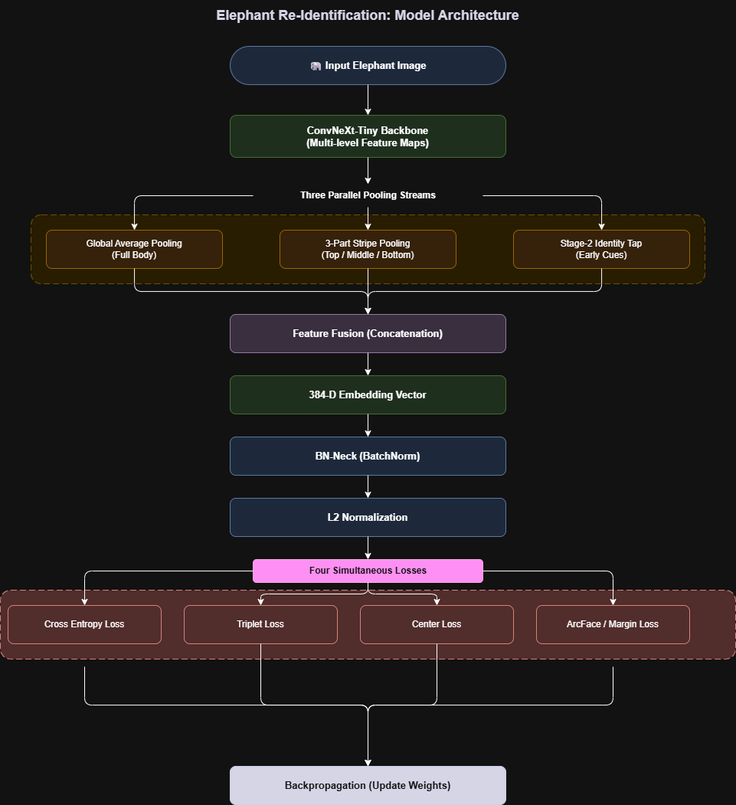

# Unique Elephant Identification System

Open-set biometric elephant re-identification for Wildlife Institute of India.  
**259 identities · 384-D embeddings · ConvNeXt-Tiny + Part-Based Pooling**

---

## Quick Start

### Training on Kaggle (GPU) ⚡
```bash
# 1. Upload kaggle/elephant-reid-training-v4.4.ipynb to Kaggle
# 2. Enable GPU (P100 or T4) + Internet
# 3. Add the `restructured-elephant-dataset` dataset
# 4. Run all cells  (~40 epochs, ~30-50 min on P100)
```

### Running the App 🐘
```bash
streamlit run app.py
```
Requires `best_model v4.6.pth` and `gallery_embeddings.pt` in the project root.

### Local Setup
```bash
python -m venv .venv
.venv\Scripts\activate
pip install -r requirements.txt
```

---

## Project Structure

```
├── app.py                        # Streamlit application (v4.6 inference)
├── best_model v4.6.pth           # Trained model weights
├── gallery_embeddings.pt         # Per-image embeddings + identity map
├── embeddings.pt                 # Full dataset embeddings (all 259 IDs)
├── kaggle/
│   ├── elephant-reid-training-v4.4.ipynb  # Training notebook (v4.4/v4.6)
│   └── dataset/                  # Kaggle dataset metadata
├── src/
│   └── models/
│       ├── dual_branch_extractor.py  # DualBranchModel (v4.4/v4.6 canonical)
│       └── __init__.py
├── tests/
│   └── eval_v46.py               # Evaluation script (leave-one-out on embeddings.pt)
├── data/                         # Datasets (gitignored)
├── docs/
│   └── model_architecture.png    # Architecture diagram
└── requirements.txt
```

---

## Model Architecture (v4.4 / v4.6)

**Backbone**: ConvNeXt-Tiny, split into three stages for layer-wise LR.



| Property           | Value                                                                        |
|--------------------|------------------------------------------------------------------------------|
| Backbone           | ConvNeXt-Tiny (ImageNet pretrained)                                          |
| Embedding dim      | 384-D                                                                        |
| Part stripes       | 3 (head / torso / legs)                                                      |
| Identities         | 259                                                                          |
| Training epochs    | 40                                                                           |
| Loss               | SemiHard Triplet + ArcFace (w=0.07) + Multi-crop Consistency + Part Dropout  |
| Input size         | 256 × 128                                                                    |
| Output             | L2-normalized 384-D embedding                                                |

### Evaluation Results

> ⚠️ **Note on metrics:** `embeddings.pt` is generated with `train_ratio=1.0` (all images used for training),
> so the leave-one-out scores below are **optimistic** — the model has seen every image during training.
> True held-out validation metrics (on the 20% val split) are lower and are printed during the Kaggle notebook run.

| Metric               | Score *(training-set eval)* |
|----------------------|-----------------------------|
| Rank-1               | 87.92%                      |
| Rank-5               | 91.42%                      |
| Rank-10              | 92.91%                      |
| mAP                  | 68.10%                      |
| Centroid Rank-1      | 87.57%                      |
| Centroid Rank-5      | 92.91%                      |
| Centroid Rank-10     | 94.22%                      |

*Eval: 1189 images, 259 identities, leave-one-out cosine similarity.*

---

## Training Configuration (v4.4 notebook)

| Parameter             | Value                        |
|-----------------------|------------------------------|
| `BATCH_SIZE`          | 32 (P=8 identities × M=4)   |
| `EMBEDDING_DIM`       | 384                          |
| `NUM_EPOCHS`          | 40                           |
| `BASE_LR`             | 3e-4                         |
| `MARGIN_PHASE1`       | 0.15 (epochs 1–15)           |
| `MARGIN_PHASE2`       | 0.22 (epochs 16–40)          |
| `ARCFACE_SCALE`       | 20.0                         |
| `ARCFACE_MARGIN`      | 0.40                         |
| `QUEUE_SIZE`          | 4096                         |
| `CONSISTENCY_WEIGHT`  | 0.045                        |
| `PART_DROPOUT_WEIGHT` | 0.10                         |

> 📊 **Metrics**: Run the notebook on Kaggle to see per-epoch Rank-1, Rank-5, mAP,
> centroid Rank-1, and TTA crop-robustness scores printed every 5 epochs.

---

## Augmentation Strategy (v4.6)

- **View 1** (train): Resize → 270×135 → RandomCrop(256×128) → HFlip → ColorJitter → GaussianBlur → RandomErasing(p=0.25)
- **View 2** (consistency): Biased region crop — 40% top (head/ears), 40% centre (torso), 20% bottom (legs) — resize to 256×128
- **Part Dropout** (p=0.70): zero one horizontal stripe per image to enforce partial-view invariance

---

## Key Files

| File | Purpose |
|------|---------|
| `app.py` | Streamlit app — batch upload, gallery matching, registration |
| `src/models/dual_branch_extractor.py` | Canonical model class + inference helpers |
| `kaggle/elephant-reid-training-v4.4.ipynb` | Full training pipeline |
| `best_model v4.6.pth` | Best checkpoint by Rank-1 |
| `gallery_embeddings.pt` | Keys: `embeddings`, `labels`, `idx_to_identity` |

---

**Wildlife Institute of India Research Project**
